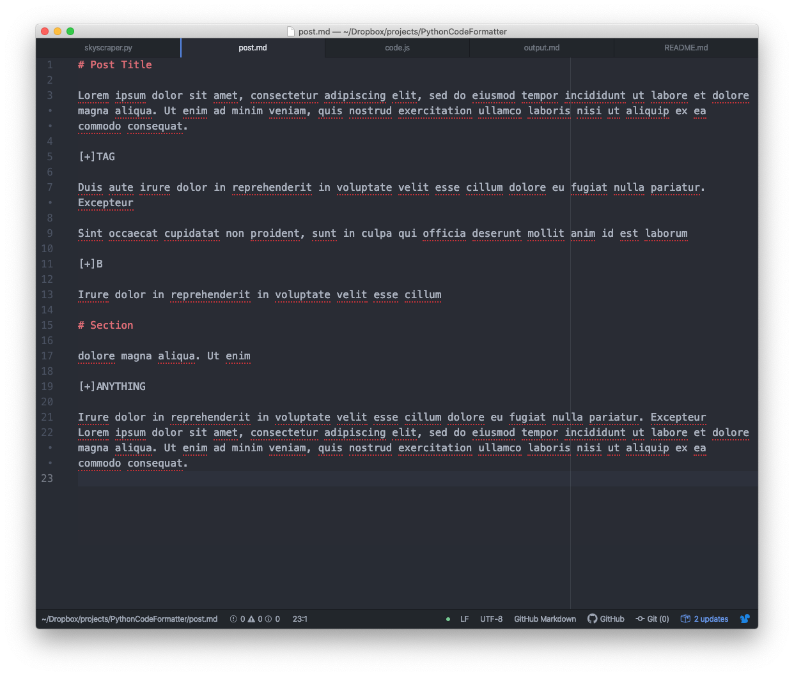
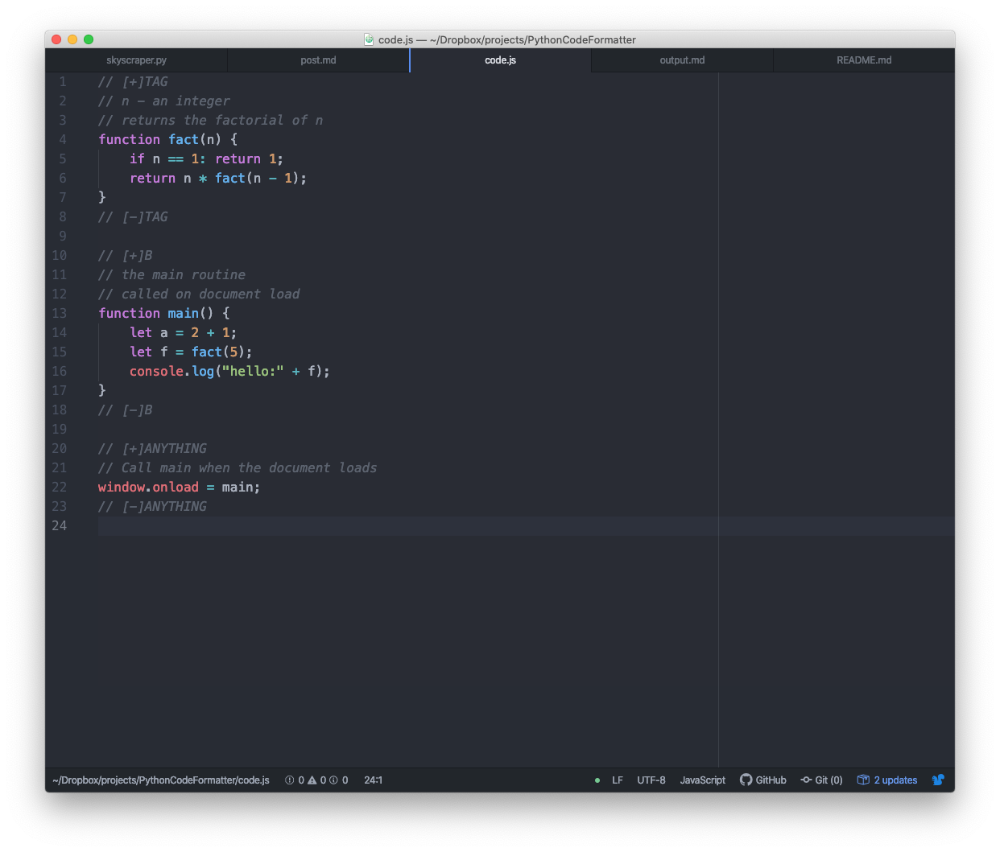
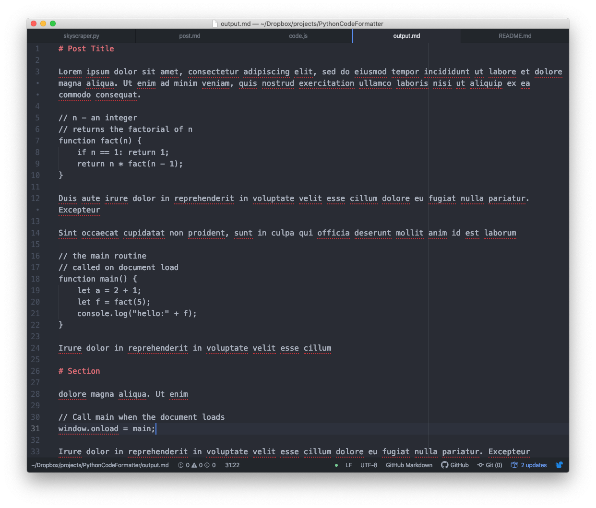

# SkyScraper

Automatically merge written content with code files using simple tag-like annotations.

Merge written content...

...with code...

...to create formatted articles:

# Tags

Any combination of letters upper or lowercase without space

# Marker Tags

A tag preceded by "[+]" example:

    [+]TagName

# Tag Pairs

Two commented out lines in a code document wrapping the lines you intend to refer to:

    [+]TagName
    ... multiple code lines
    [-]TagName

# Run Command

Run skyscraper with the following command:

    python skyscraper.py [doc] [code] [output]

`doc`: path to document containing `Marker Tags`

`code`: path to code containing `Tag Pairs`

`output`: (optional) name of output file defaults to "output" extension is copied from doc
